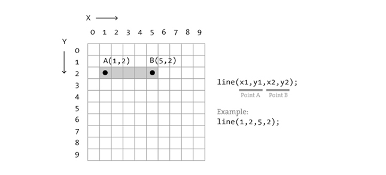
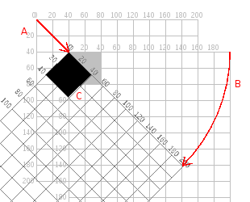
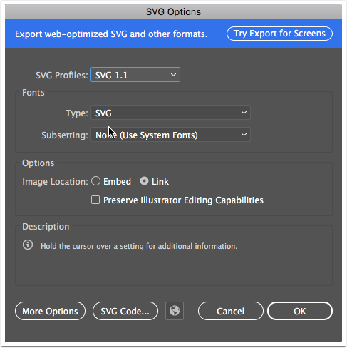

# Generative Art


## Week 1 - Day1:

- Processing is an Open Source Project initiated by Ben Fry and Casey Reas.
- Tool  allows artists/designers to use the computer as a tool to create graphics.
- To reinforce this Processing refers to programs as sketches.
- The reference is on http://processing.org. It is very comprehensive and full of applied examples

### Commands:

Some graphic primitives are drawn by using these commands:

#### Rect

`rect(x,y,w,h);`

- for example:

  `rect(100,100,50,50);`

` rectMode(CENTER, CORNER, CORNERS)`

- changes the way rectangles are created. 

- default rectMode is CORNER

  #### Ellipse

  `ellipse(x,y, w, h);`

- for example:

  `ellipse(100,100,50,50);`

  #### Line

- `line(x1, y1, x2, y2);`

- for example: 

  `line(100,100, 200,100);`

### Saving

- The program (or sketch) is saved as a .pde file
- saved in a folder with the name same as the sketch
- This is stored in Documents\Processing by default
- location can can be changed by modifying the preferences  (Shortcut:  CTRL | CMD &  ,)
- The size of the display can be changed  using `size(x,y);`

```java
size(1920,1080);
```

### Comments

- are lines that are ignored by the program
- used for comments to explain the program
- to temporarily disable a command

```java
	// single line comment 

	/*
	multiline comment
	*/
```

### Colour - RGB, hex

- Greyscale with alpha: `fill(127,100);`
- RGB red: ` fill(255,0,0); `
- RGB red with alpha: `fill(255,0,0,100)`;
- You can use the colour picker in Tools > Color Selector

### Strokes

- `strokeWeight(5); //changes weight of stroke to 5`
- `stroke(0,0,255);  //makes strokes blue`
- strokes can be turned off: `noStroke()`

### Coordinate System

	

- top left corner is 0,0
- horizontal axis is X
- vertical axis is Y
- measured in pixels.
- The following code place a rectangle at x: 20 and y: 50, with a widht and height of 50 pixels
  - `rect(20,50,100,100);`

### pushMatrix popMatrix();

- the coordinate system can be manipulated.
- The origin x;0,y:0 can be moved to  a different location than the top left corner
- this is achieved with `pushMatrix()`; and `popMatrix();`

```java
pushMatrix(); //allow coordinate system to be shifted
translate(250,250); //move origin to x: 250, y: 250
rotate(PI/4);
rect(0,0,100,100); //draw the rectangle at the new origin
popMatrix(); //push the origin back to the orignal location
```

### Transforms

- pushMatrix enables the coordinate system to be shifted but the actual move needs to be achieved by transform operations:

  

- translate(x,y)` actually shifts the origin.

- other coordinate transformation that are possible are:

- `scale(0.6)`  scales cordinate system to 60%, i.e. a `rect(0,0,100,100)` would result in a 60 px width and tall rectangle

  

- `rotate(radian)` rotates the cordinate system by a specified amount. 

- The radian is a value that expresses rotation as multiples of Pi. 360 = 2 * PI The table below illustrates this.

- | Degrees | Radians   |
  | ------- | --------- |
  | 45      | PI/4      |
  | 90      | PI/2      |
  | 180     | PI        |
  | 270     | PI + PI/2 |
  | 360     | 2 * PI    |

  Processing also allows you to use degrees but the need to be converted using the  `radians()` function. 

### Functions 1

- Your own customised commands.
- Allows to structure code so that it can be reused by giving it a specific name
- Avoid repetition, DRY principle in programming
- **Syntax**:

```java
void drawTheThingy(){
    fill(255);
    rect(0,0,100,100);
}
```

  call this by typing in `drawTheThingy()`

- Your functions can receive value that modify what is executed. These are called parameters or arguments. 

- ------

## 17/1/18 Week 1 - Day2:

### Code Structure

- Sketches are usually structured using a `setup` and `draw` **code block**.
- code block use `{ .... }` squiggly brackets to start and end
- importance of **indentation**
- Remember, yesterday we got an `active and passive mode error` when we created a function. This is because if you define your own function processing expects the standard functions `setup()` and `draw()`;

```java
	 void setup() {
		  //code block here runs once	
	  }
	
	  void draw() {
	    //draws 30 fps 
	    //can be changed with framerate(x);
	  }
```

### Variables

- are containers that store specific values that can be reused or increased.

#### Integers

- stores a simple number without decimal points.

- can be negative

  ```int myFavouriteNumber = 5;```

#### Float - decimal points

- contain numbers with decimal points

- larger memory requirement to store

- more complex to use in calculations.

  ```float myVersionofPi = 3.14159```

#### Booleans

- named after George Boole - worked and lived in Cork

- can be either `true` or `false`

  ```boolean canBeItTrue = true //or false;```

#### Color

- allows you to store pre-determined colours for a palette of your choice.

```java
	//colours as variables
	color c1 = #0CE88B;
	color c2 = #8DE88C;
	color c3 = color(255,0,0); //RGB notation
	
	fill(c1);
```

### Changing variables

- Use +,-,*,/ operators to change the value of variables.

```java
myFavouriteNumber = myFavouriteNubmer + 1; 
// I changed my mind. My NEW farvouriteNumber is NOW 6. 
myFavouriteNumber = myFavouriteNubmer - 1; 
// I have been unfaithful to you 5. I am sorry.
```

- this is a shorthand:

```java
myFavouriteNumber +=  1; // shorthand 
myFavouriteNumber -=  1; 
```

- the value of variable can be viewed in the Console by using `println()`
- this is useful for **debugging**, i.e. figuring out why your code doesn't do what it is supposed to. 

```java
println(myFavouriteNumber);
```

### System Variables

- some variable are used by processing, we have already used
- `width` and `height`. 
- stores the  width and height of the Processing window. 

```java
  rectMode(CENTER);
  rect(width/2,height/2,100,100)
```

### Random Numbers 1

- random numbers can be generated by using `random()`. Random returns a float, so it needs to be either stored inside a float or it gets converted to an int using `int()`. (see second and third example)

```java
  float myRandom = random(255) // creates a  number between 0 -255
  int myRandom2 = int(random(1,10))// creates a random number between 0 - 10
  int myRandomX = int(random(width))// creates a random number between 0 - wdith of Window
```

### Functions 2

- continuation from functions yesterday.
- Functions can receive value that modify what is executed. These are called parameters or arguments. 

```java
void myFunction(int x, int y, int w) {

  		//execute this stuff here
        rectMode(CENTER)
  		rect(x,y,w,w)
  		ellipse(x,y,w-10,w-10);
}
```

- Call this function by typing in ``myFunction(200, 200, 100,100);``

### Mouse Interaction

- System variables that contain the mouse position
  - mouseX: x position of the mouse on the screen
  - mouseY: y position of the mouse on the screen
  - mousePressed: a system variable (pink) that is true if the mouse is clicked. 

------

## 18/1/18 Week 1 - Day4:

### Conditionals

- If.. then - conditionals 
- allows decision making

```java
if ( test condition here ) {
   		//condition is true  - do this
} else {
   		//otherwise - do this 
}

```

[Do it](https://www.youtube.com/watch?v=Ra70O9nps6E "Starsky and Hutch remake") 

- For example: this changes the background colour based on the position of the mouse.

```java
  if (mouseX > 200) {
      background(0);
  } else {
      background(255);
  }
  if (mouseY > 200) {
      background(255,0,0);
  } else {
      background(0,255,0);
 }
```


### Boolean Operators

- multiple test can be combined in a single condition of an If... then test

#### &&: logical AND

- combines two tests. Only if both tests are true the if statement will execute:

```java
if (student == true && offPeak == true) {
	//do it
}
```

- for example if a traveller can avail of a discount if he/she is a student AND travels offpeak

#### ||: logical OR

- combines two tests. If either of the  tests are true the if statement will execute:
  ​

```java
if (student == true || offPeak == true) {
	//do this
}
```

- i.e. a discount will be applied for a student or anybody else travelling during off-peak

- ------

  ​

## 23/1/18 Week 2 - Day1:

### Repetition - For loops

- repeats code a number of times
- the condition of the for loop is inside the () brackets
- It has 3 parts
  - 1st part sets the counter to 0;
  - 2nd part is the condition. keep looping until i reaches 5.
  - 3rd part increases the counter

#### Syntax:

```java
int i; //this is your counter

for (i=0; i< 5; i=i+1 ) {

//code block gets executed repeatedly
	println(“I am the counter: “, i);

}
```


------

### Nested For loops

- Used for repeating something using two counters.
- This is commonly used for grid-layouts, like a chessset
  - both loops have a counter
  - outer loop has counter i
  - inner loop has conter j
  - the position of the rectangle inside the grid is calculated using one counter for vertical position and the other for the horizontal position

```java
//outer loop
for (int i=0; i< 5; i=i+1 ) {
//inner loop
  for (int j=0; j< 5; j=j+1 ) {
  //code block gets executed repeatedly
    println(“I am the counter: “, j);
    rect(i*100,j*100,100,100);
  }
}
```

- We can call functions from  inside a loop

```java
for (i=0; i< 5; i=i+1 ) {
    //call function 5x at once with random X and random Y.
    drawTheThingy(random(width), random(height), myMag, angle, 75,circleSize, c1, c3);;
}
```

------

## 25/1/2018 Week 2 - Day 7

### Shapes

- Shapes are more complex than just a standard rectangle

- they are stored in a variable called `PShape`.

  ```java
  PShape s;
  s = createShape();
  s.beginShape();
    s.fill(0, 0, 255); //this section defines the shape
    s.noStroke();
    s.vertex(0, 0);//adding individual points to the shape
    s.vertex(0, 50);
    s.vertex(50, 0);
   s.endShape();  //shape is finished
  
  shape(s, 50, 50); //this draws the shape
  ```

### Loading Shapes

- Shapes can be loaded from external .svg files. 
- these files need to be stored inside a subfolder of the sketch called "data":


- Vector graphics can be opened in Illustrator and then saved using File > Save as > Filetype .svg.

- The export option should state SVG profile 1.1

  

- ```java
  PShape s;
  
  void setup() {
    size(239, 239);
    s = loadShape("pattern01.svg");        
    s.setStroke(color(0,0,255));
    shape(s, 0, 0);
  }
  ```

- The shape gets stored in Pshape

- `loadShape()` loads a .svg file.

- `shape(s,x,y)` places the shape at position x and y.

- `s.disableStyle();` allows the default colours of the loaded .svg file to be turned off and other colouring options can be set with `fill()` and `stroke()`

------

### Arrays

- a list of values
- like a shopping list
- each item inside the list is identifed by an index number
- the first item has the index number 0;

#### Creating an array

```java
float[] xpos = new float[5];
```

- identify which datatype is stored inside the array
- [] means it is an array
- xpos is the name of the array

#### Manually setting a value in an array

```java
xpos[0] = 5.0;
```

#### Retrieving a value from an array

```java
println(xpos[0]);	
```

#### Initialising an array and setting values

```java
float [] xpos =  {123,234,345,456,567};
```

- creates an array. 
- Fills 5 spaces in the list

#### Looping through an array and setting all values

```java
for (int i=0;i< 5;i++){
	xpos[i] = random(width); //counter i accesses the item 		
}
```

#### Looping through an array and getting all values

```java
for (int i=0;i< 5;i++){
	println(xpos[i]); 
  //counter i accesses the item
}
```

#### Example: Array of colors

```java
color[] c = {#FFB285,#E80C7D, #4B00FF, #0C9CE8, #0DFF65};
//somewhere else
fill(c[0]);
```

#### Example: Array of points on the screen

```java
PVector[] vectors = new PVector[5];
for (int i = 0; i < vectors.length; i++) {
        vectors[i] = new PVector();
}

```

#### Tutorial

- https://processing.org/tutorials/arrays/

  ------

### Modulo

- when dividing  and the result isn't even, what remains is called the **remainder**.
- for example:
  - The remainder of 16 divided by 5: 16 = (5 *3) + **1**
  - The remainder of 17 divided by 5: 17 = (5*3) + **2**.
- This operation is expressed using the **%** sign.
- for example, above

```java
  println(16%5) //prints 1
  println(17%5) //prints 2
```

- This can be useful because it creates a repeating sequence of remainders for **any** number that increases each time

- for example, given a increasing int variable counter and a %3 operation: 

  | int counter | Value of **counter%3** |
  | ----------- | ---------------------- |
  | 0           | 0                      |
  | 1           | 1                      |
  | 2           | 2                      |
  | 3           | 3                      |
  | 4           | 0                      |
  | 5           | 1                      |
  | 6           | 2                      |
  | 7           | 3                      |

- this can be used  to repeatedly execute something if the value of counter reaches a particular value

```java
if (counter%3== 0) {
  //do something every 3rd time
}
```

------

### Randomness No. 2

- randomness can be controlled using conditionals:

```java
   if (random(1)< 0.65) {
          
          shape(s, 0, 0);
   }
```

In this code the shape only gets drawn when the random generated number is above .65, i.e. only in 35% of the cases.

------


